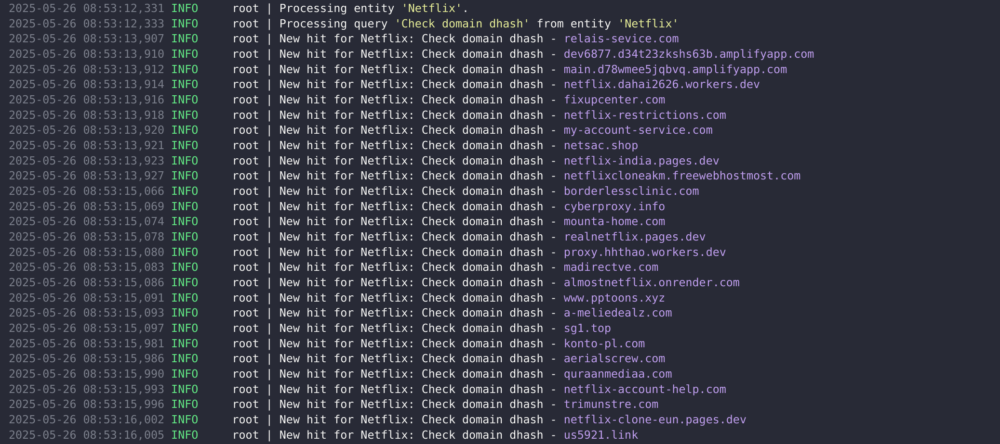

# Guardian - Automated VirusTotal Threat Hunting

Guardian is a compact, self-contained command-line tool that transforms a single JSON rule file into a VirusTotal hunting pipeline. The JSON file groups one or more “entities”, for example customers or internal business units, with the VirusTotal search strings you want to run for each of them. On every execution Guardian reads the file, issues the searches, deduplicates the results, and records any new findings in an embedded SQLite database. Because it stores only the delta, each run is quick and idempotent. 

An empty Notification stub is already in place so you can wire the pipeline into Slack, Microsoft Teams, email, or any other alert system without changing the core code. Designed to stay out of your way, Guardian fits naturally into a daily cron job, a CI stage, or an ad-hoc batch investigation.

## Demo



## Getting started

### Create a JSON Rule Schema

Create a file such as `entities.json`. The minimal schema looks like this:

```json
{
    "entities": 
    [
        {
            "name": "Acme Corp",
            "queries": 
            [
                {
                    "label": "Check domain dhash",
                    "query": "entity:domain main_icon_dhash:your_icon_dhash NOT parent_domain:your_domain"
                }, 
                {
                    "label": "Check typosquatted domains",
                    "query": "entity:domain fuzzy_domain:your_domain NOT parent_domain:your_domain last_update_date:2020-01-01+ p:1+"
                }
            ]
        }
    ]
}
```

The first sample query hunts for any domain whose favicon shares the same perceptual hash as Acme’s official site while explicitly excluding the real parent domain itself. Attackers frequently copy a brand’s favicon to lend credibility to phishing pages, so matching on the icon’s dhash is an easy way to surface these impostors. 

The second query focuses on typosquatted look-alikes: it asks VirusTotal for domains that resemble acme.com according to the built-in fuzzy_domain heuristic, again filters out the legitimate domain, restricts results to results updated after 1 January 2020, and insists that at least one vendor has already marked the sample as suspicious or malicious `(p:1+)``.

- `name`: Friendly label for the entity (used to generate the SQLite table name).
- `query`: A complete VirusTotal Intelligence search string.
- `label`: Shown in logs and, once you implement it, in notifications.

### Clone the Repository

```bash
git clone https://github.com/hexastrike/guardian.git
cd guardian
```

### Create Your `.env`

```bash
cp template.env .env
```

Open the file and paste your VirusTotal API key:

```dotenv
VT_API_KEY=<your-virustotal-key>
```

### Install & Run

```bash
# Install dependencies + the package itself into Poetry’s venv
poetry install

# Run once (replace with your own entities.json path)
poetry run guardian --json-entities examples/entities.json
```

## Notifications

Guardian’s alerting layer is intentionally minimal so you can bend it to your own environment. A single class, guardian.runtime.notification.Notifier, is instantiated only when you pass the `--notify`` flag on the command line. For every brand-new VirusTotal hit, Guardian calls

```python
self._notifier.notify(
    {
        "entity": "Acme Corp",
        "label": "Typosquatted domains",
        "resource_id": "example.com",
        "resource_type": "domain",
    }
)
```

Out of the box this simply prints a one-liner to stdout, which is handy for demo runs and CI logs:

```text
[Guardian] entity='Acme Corp' label='Typosquatted domains' resource_id='example.com' type='domain'
```

### Disabling Alerts

Simply omit `--notify` (the default) and Guardian runs silently aside from its normal log output—perfect for development or environments where notifications are handled elsewhere.

